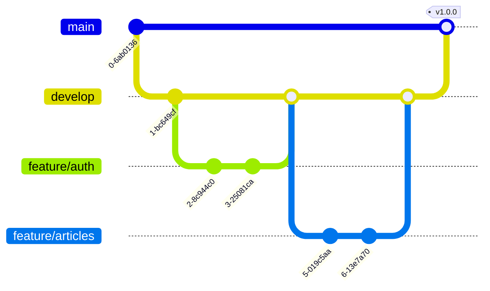

# RealWorld (Conduit) 시스템 디자인 문서

## 목차
1. [개요](#1-개요)
2. [시스템 아키텍처](#2-시스템-아키텍처)
3. [데이터베이스 설계](#3-데이터베이스-설계)
4. [API 설계](#4-api-설계)
5. [프론트엔드 아키텍처](#5-프론트엔드-아키텍처)
6. [백엔드 아키텍처](#6-백엔드-아키텍처)
7. [보안 설계](#7-보안-설계)
8. [배포 아키텍처](#8-배포-아키텍처)
9. [성능 최적화 전략](#9-성능-최적화-전략)

---

## 1. 개요

### 1.1 목적
이 문서는 RealWorld (Conduit) 애플리케이션의 기술적 설계를 정의합니다. Medium.com 클론으로서 소셜 블로깅 플랫폼의 모든 기술적 측면을 다룹니다.

### 1.2 설계 원칙
- **Agentic Coding 최적화**: AI 어시스턴트와의 협업에 최적화된 단순하고 명시적인 코드
- **모듈식 아키텍처**: 프론트엔드와 백엔드의 완전한 분리
- **RealWorld 사양 준수**: 표준 API 스펙 완벽 구현
- **확장 가능성**: 수평적 확장이 가능한 설계
- **보안 우선**: 모든 레이어에서 보안 고려

### 1.3 기술 스택 요약
- **백엔드**: Go (Echo/Gin), SQLite, JWT
- **프론트엔드**: React 18, TypeScript, Vite, TanStack Router/Query
- **인프라**: Docker, Docker Compose
- **개발 도구**: Makefile, Git

---

## 2. 시스템 아키텍처

### 2.1 전체 시스템 구조


### 2.2 컴포넌트 설명

#### 2.2.1 Client Layer
- 웹 브라우저와 모바일 브라우저 지원
- Progressive Web App (PWA) 지원 가능

#### 2.2.2 Frontend Application
- **React SPA**: 단일 페이지 애플리케이션
- **TanStack Router**: 타입 안전 라우팅
- **Zustand**: 클라이언트 상태 관리
- **TanStack Query**: 서버 상태 관리 및 캐싱

#### 2.2.3 Backend Application
- **Go REST API**: RESTful API 서버
- **Auth Middleware**: JWT 토큰 검증
- **Service Layer**: 비즈니스 로직 처리
- **Repository Layer**: 데이터 접근 추상화

### 2.3 데이터 흐름


---

## 3. 데이터베이스 설계

### 3.1 Entity Relationship Diagram


### 3.2 인덱스 전략

```sql
-- Users 테이블 인덱스
CREATE UNIQUE INDEX idx_users_email ON users(email);
CREATE UNIQUE INDEX idx_users_username ON users(username);

-- Articles 테이블 인덱스
CREATE UNIQUE INDEX idx_articles_slug ON articles(slug);
CREATE INDEX idx_articles_author_id ON articles(author_id);
CREATE INDEX idx_articles_created_at ON articles(created_at DESC);

-- Comments 테이블 인덱스
CREATE INDEX idx_comments_article_id ON comments(article_id);
CREATE INDEX idx_comments_author_id ON comments(author_id);

-- Tags 테이블 인덱스
CREATE UNIQUE INDEX idx_tags_name ON tags(name);

-- 관계 테이블 인덱스
CREATE UNIQUE INDEX idx_article_tags ON article_tags(article_id, tag_id);
CREATE UNIQUE INDEX idx_user_follows ON user_follows(follower_id, followed_id);
CREATE UNIQUE INDEX idx_article_favorites ON article_favorites(user_id, article_id);
```

### 3.3 데이터 무결성
- Foreign Key 제약 조건 사용
- CASCADE DELETE for 관련 데이터
- NOT NULL 제약 조건
- UNIQUE 제약 조건

---

## 4. API 설계

### 4.1 API 구조


### 4.2 Request/Response 플로우


### 4.3 API 버전 관리
- URL 버전 관리: `/api/v1/`
- 하위 호환성 유지
- Deprecation 정책 문서화

### 4.4 에러 처리 표준

```json
{
  "errors": {
    "body": ["can't be empty"],
    "title": ["is too short (minimum is 1 character)"]
  }
}
```

---

## 5. 프론트엔드 아키텍처

### 5.1 컴포넌트 구조


### 5.2 상태 관리 아키텍처


### 5.3 라우팅 구조


```typescript
// 라우팅 설정 코드
const routes = {
  '/': HomePage,
  '/login': LoginPage,
  '/register': RegisterPage,
  '/settings': SettingsPage,
  '/editor': EditorPage,
  '/editor/:slug': EditorPage,
  '/article/:slug': ArticlePage,
  '/profile/:username': ProfilePage,
  '/profile/:username/favorites': ProfilePage
}

// 보호된 라우트 HOC
const ProtectedRoute = ({ children }) => {
  const { isAuthenticated } = useAuth();
  if (!isAuthenticated) {
    return <Navigate to="/login" />;
  }
  return children;
}
```

---

## 6. 백엔드 아키텍처

### 6.1 레이어드 아키텍처


### 6.2 의존성 주입

```go
// 의존성 주입 컨테이너 구조
type Container struct {
    Config     *config.Config
    DB         *sql.DB
    UserRepo   repository.UserRepository
    UserService service.UserService
    AuthHandler handler.AuthHandler
}
```

### 6.3 동시성 처리
- Go 루틴을 활용한 비동기 처리
- 채널을 통한 통신
- Context를 활용한 요청 취소
- 뮤텍스를 사용한 공유 자원 보호

---

## 7. 보안 설계

### 7.1 보안 아키텍처


### 7.2 인증 플로우


### 7.3 보안 체크리스트
- [x] HTTPS 강제
- [x] JWT 토큰 만료 시간 설정
- [x] 비밀번호 복잡도 검증
- [x] SQL Prepared Statements 사용
- [x] XSS 방지를 위한 출력 이스케이핑
- [x] CORS 정책 설정
- [x] Rate Limiting 구현
- [x] 보안 헤더 설정

---

## 8. 배포 아키텍처

### 8.1 컨테이너 아키텍처


### 8.2 CI/CD 파이프라인


### 8.3 환경별 설정

| 환경 | 목적 | 데이터베이스 | 로깅 레벨 | 디버깅 |
|-----|------|------------|----------|--------|
| Development | 로컬 개발 | SQLite (로컬) | DEBUG | 활성화 |
| Staging | 테스트/QA | SQLite (볼륨) | INFO | 활성화 |
| Production | 실제 서비스 | SQLite (백업) | WARN | 비활성화 |

---

## 9. 성능 최적화 전략

### 9.1 프론트엔드 최적화


### 9.2 백엔드 최적화

#### 9.2.1 데이터베이스 최적화
- 적절한 인덱스 생성
- 쿼리 최적화
- Connection Pooling
- Prepared Statements 캐싱

#### 9.2.2 캐싱 전략


### 9.3 모니터링 메트릭

| 메트릭 | 목표 | 임계값 | 액션 |
|-------|------|--------|------|
| API Response Time | < 200ms | > 500ms | 알림 발송 |
| Page Load Time | < 2s | > 3s | 성능 분석 |
| Error Rate | < 0.1% | > 1% | 즉시 대응 |
| Database Query Time | < 50ms | > 100ms | 쿼리 최적화 |
| Memory Usage | < 70% | > 90% | 스케일링 |

### 9.4 부하 처리 전략


---

## 10. 개발 워크플로우

### 10.1 브랜치 전략



### 10.2 개발 프로세스

1. **요구사항 분석**: PRD 문서 기반
2. **설계**: 기술 설계 문서 작성
3. **구현**: TDD 방식 개발
4. **테스트**: 단위/통합/E2E 테스트
5. **리뷰**: 코드 리뷰 및 피드백
6. **배포**: CI/CD 파이프라인
7. **모니터링**: 성능 및 에러 모니터링

---

## 11. 테스트 전략

### 11.1 테스트 피라미드


### 11.2 테스트 커버리지 목표
- Unit Tests: 80% 이상
- Integration Tests: 60% 이상
- E2E Tests: Critical Path 100%

---

## 12. 문서화

### 12.1 문서 구조
```
docs/
├── API.md          # API 명세
├── DESIGN.md       # 시스템 설계 (현재 문서)
├── DEPLOYMENT.md   # 배포 가이드
├── DEVELOPMENT.md  # 개발 가이드
└── TROUBLESHOOTING.md # 문제 해결 가이드
```

### 12.2 코드 문서화
- Go: godoc 형식
- TypeScript: JSDoc/TSDoc
- API: OpenAPI 3.0 Specification

---

## 13. 결론

이 디자인 문서는 RealWorld 애플리케이션의 기술적 청사진을 제공합니다. Agentic Coding 원칙에 따라 단순하고 명시적인 설계를 추구하며, 확장 가능하고 유지보수가 용이한 시스템을 목표로 합니다.

### 핵심 성공 요소
1. **모듈화**: 각 컴포넌트의 독립성 보장
2. **표준 준수**: RealWorld API 사양 완벽 구현
3. **보안**: 모든 레이어에서 보안 고려
4. **성능**: 최적화된 쿼리와 캐싱 전략
5. **확장성**: 수평적 확장 가능한 아키텍처

### 다음 단계
1. 프로토타입 구현
2. 성능 벤치마크
3. 보안 감사
4. 사용자 피드백 수집
5. 지속적인 개선

---

## 참고 자료
- [RealWorld 공식 문서](https://realworld-docs.netlify.app/)
- [Go 공식 문서](https://golang.org/doc/)
- [React 공식 문서](https://react.dev/)
- [SQLite 공식 문서](https://www.sqlite.org/docs.html)
- [Agentic Coding](https://lucumr.pocoo.org/2025/6/12/agentic-coding/)